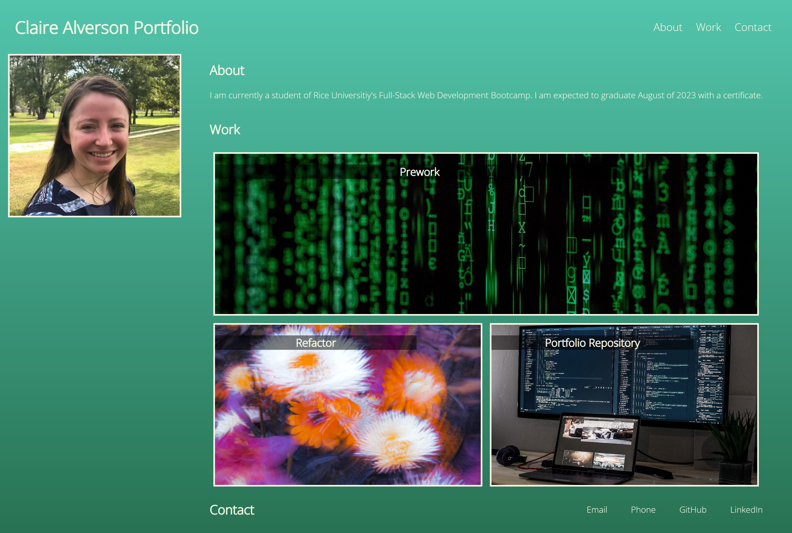

# Portfolio: Claire Alverson

## Description

This is a webpage to display my work. 

This was a practice in advanced CSS including but not limited to:
- :root element
- flexbox
- grid
- linear gradients
- media query

Over the course of the bootamp new content will be added. This includes all of the smaller weekly challenges (which should sum to 22) and the three group projects.

Once I am nearing or have graduated, I will modify this README to better align with what employers would look for in a portfolio's README.

## Installation

N/A

## Usage

Webpage: https://ctalv.github.io/portfolio_claire_alverson/

## Credits

HTML Boilerplate: https://www.freecodecamp.org/news/basic-html5-template-boilerplate-code-example/
Images (individual credit in alt tags of photos) https://unsplash.com/ 

## License

MIT License

# Module_1_Challenge

